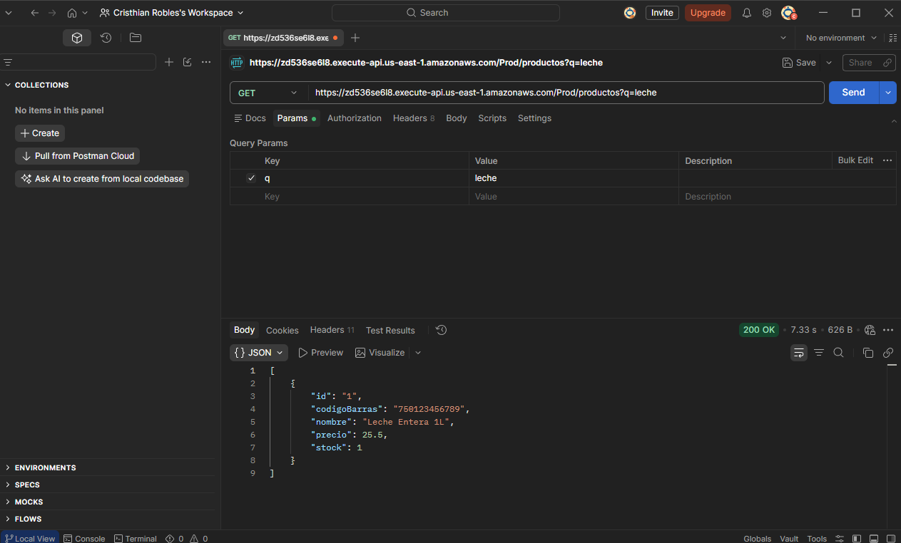
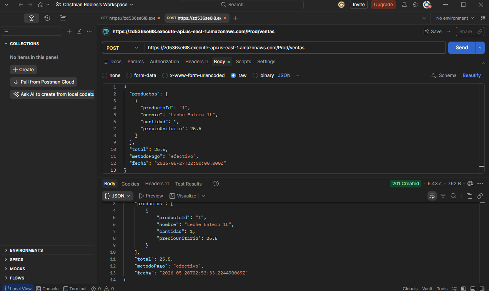
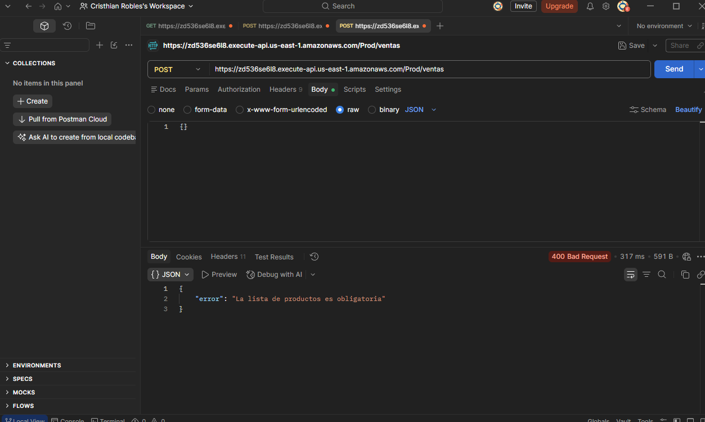
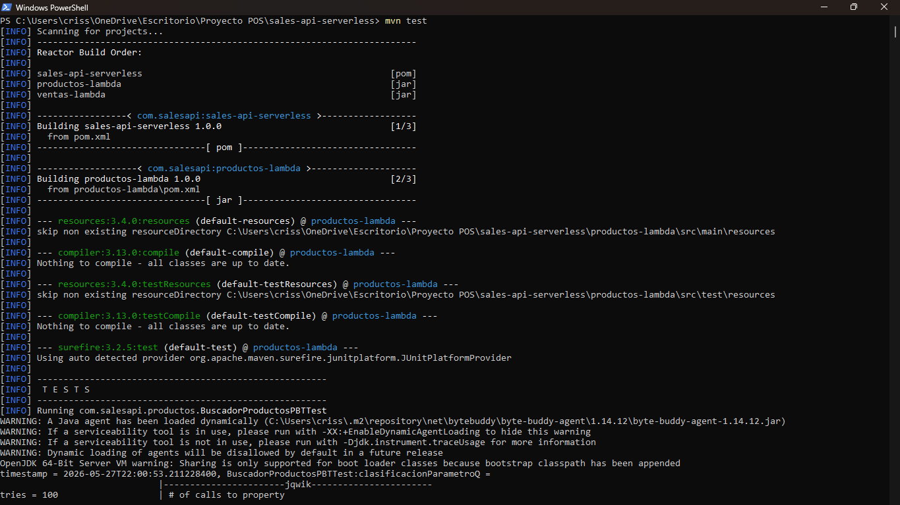
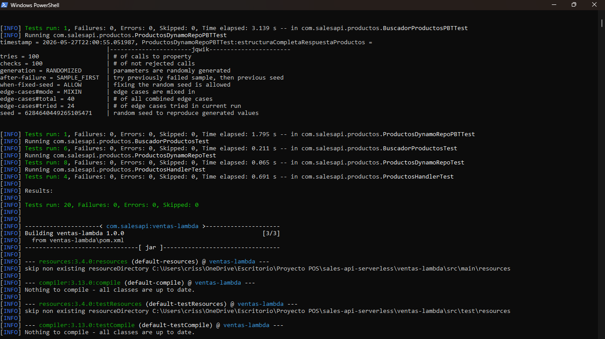
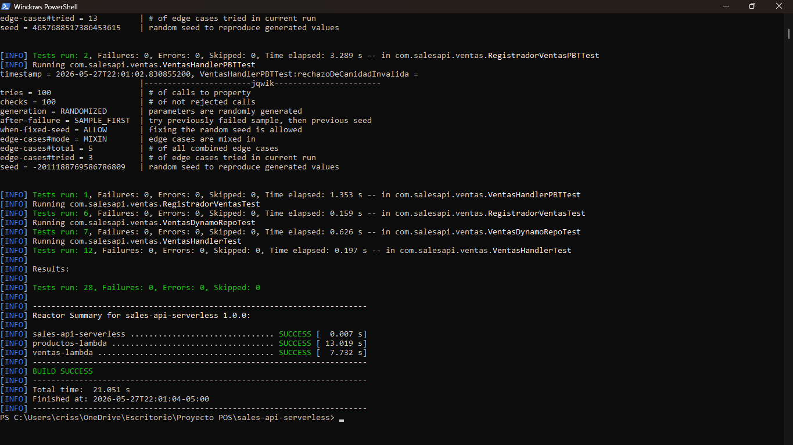

# Sistema POS Serverless

API REST serverless para un sistema de Punto de Venta (POS), construida sobre AWS Lambda, API Gateway y DynamoDB, desplegada con AWS SAM.

---

## Arquitectura del Sistema

`\nFrontend (Node.js + Express)
        |
        | HTTP/JSON
        v
API Gateway (AWS)
https://zd536se6l8.execute-api.us-east-1.amazonaws.com/Prod
        |
        |---> GET  /productos --> ProductosLambda      --> DynamoDB (Productos)
        |---> POST /productos --> CrearProductoLambda  --> DynamoDB (Productos)
        |---> POST /ventas    --> VentasLambda         --> DynamoDB (Ventas + Productos)
        |---> GET  /ventas    --> ConsultaVentasLambda --> DynamoDB (Ventas)
`\n
### Servicios AWS

| Servicio | Rol |
|---|---|
| API Gateway | Expone endpoints HTTP publicos y enruta peticiones a Lambdas |
| AWS Lambda (Java 21) | Logica de negocio serverless, una funcion por operacion |
| DynamoDB | Base de datos NoSQL administrada con escalado automatico |
| IAM | Permisos minimos por rol de Lambda |
| AWS SAM | Infraestructura como codigo |

### Tablas DynamoDB (estructura NoSQL)

Ambas tablas tienen solo 2 columnas: id (PK) + detalle (Map JSON nativo)

**Productos:** id | detalle: { nombre, codigoBarras, precio, stock }

**Ventas:** id | detalle: { productos (List), total, metodoPago, fecha }

---

## URL del API Gateway

`\nhttps://zd536se6l8.execute-api.us-east-1.amazonaws.com/Prod\n`\n
---

## Instrucciones de Despliegue

### Prerrequisitos
- AWS CLI configurado
- AWS SAM CLI instalado
- Java 21 y Maven instalados

### 1. Compilar

`ash
cd sales-api-serverless
sam build
`\n
### 2. Desplegar

`ash
sam deploy --guided
`\n
Valores recomendados:
- Stack Name: sales-api-serverless
- AWS Region: us-east-1
- Confirm changes: y

### 3. Despliegues posteriores

`ash
sam deploy
`\n
---

## Capturas de Postman

### GET /productos

### POST /ventas

### Caso de error (400)

---

## Pruebas Unitarias

48 pruebas en total, 0 fallos. Ejecutar con:

`ash
mvn test
`\n

---

## Proceso SDD (Spec Driven Development)

Este proyecto sigue la metodologia SDD: primero se definen los specs, luego se implementa.

Los specs estan en .kiro/specs/pos-backend/:

| Archivo | Contenido |
|---|---|
| requirements.md | Requisitos funcionales, no funcionales y criterios de aceptacion |
| design.md | Arquitectura, contratos de endpoints, estructura de tablas DynamoDB |
| tasks.md | Tareas de implementacion en orden de ejecucion |

Flujo SDD seguido:
1. Se escribieron los specs en .kiro/specs/pos-backend/
2. Kiro genero las tareas de implementacion
3. Se implementaron las Lambdas trazables a cada tarea del tasks.md
4. Se escribieron pruebas unitarias con mocks de DynamoDB
5. Se desplegó la infraestructura con sam deploy

---

## Tecnologias

- Java 21 — Runtime de las Lambdas
- AWS SAM — Infraestructura como codigo
- AWS Lambda — Computo serverless
- Amazon API Gateway — Endpoints HTTP
- Amazon DynamoDB — Base de datos NoSQL
- Maven — Gestion de dependencias
- jqwik — Property-based testing
- JUnit 5 — Pruebas unitarias
